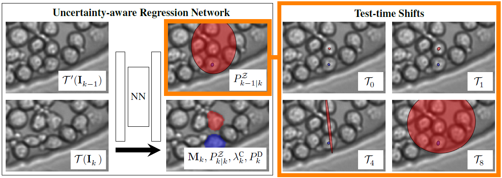

[](https://opensource.org/licenses/MIT)

<h1 align="center">Cell Tracking according to Biological Needs</h1>
<h2 align="center">Strong Mitosis-aware Random-finite Sets Tracker with Aleatoric Uncertainty</h2>

<p align="center">
  
  <br>
    <em>The output distribution of EmbedTrack using different input transformations on BF-C2DL-HSC.</em>
</p>


**Note:** This repository is under construction. Names, links and other information will be updated soon.


## Introduction
This repository provides a modified version used in the 
**[7th ISBI challenge](https://celltrackingchallenge.net/ctc-vii/)** of 
the method described in the
**[Paper](https://arxiv.org/abs/2403.15011)**
**Cell Tracking according to Biological Needs - 
Strong Mitosis-aware Random-finite Sets Tracker with Aleatoric Uncertainty**. 
The modifications are described [here](AFTER_ISBI_SUBMISSION).

The framework is partially built on top of the **[EmbedTrack](https://git.scc.kit.edu/kit-loe-ge/embedtrack)** 
repository of **Loeffler et al.**. We removed the training scripts and unrelated 
code that is not needed for the inference. The method *EmbedTrack* is extended 
with test time augmentation to generate association distributions.
We refer to the original repository for training scripts and
more detailed information about EmbedTrack.
The association distributions are stored during inference alongside the tracking 
masks and are used to generate the final tracking results explained in the next paragraph.

The multi hypothesis tracking framework is located in the 'mht' folder. The global
association framework is applied to the association distributions generated by EmbedTrack
and creates a final tracking result. The tracking result is saved in the CTC format
and can be evaluated by the CTC.

To make our code more accessible, we added a **[Google Colab Notebook](ynb)** 
for simple inference on data sets from the Cell Tracking Challenge. 
The Colab notebook includes all steps: setting up the environment, 
retrieving the CTC data sets and inference.


## Dependencies 
We have tested this implementation using `pytorch` version 1.13 and `cudatoolkit` version 11.7 on a `linux` OS machine. 

To create the environment `venv_embedtrack` please run
```
conda env create -f environment.yml
```


## Datasets
We evaluated our approach on 2D data sets from the **[Cell Tracking Challenge (CTC)](http://celltrackingchallenge.net)**:

- Fluo-N2DH-SIM+
- Fluo-C2DL-MSC
- Fluo-N2DH-GOWT1
- PhC-C2DL-PSC
- BF-C2DL-HSC
- Fluo-N2DL-HeLa
- BF-C2DL-MuSC
- DIC-C2DH-HeLa
- PhC-C2DH-U373

All datasets can be retrieved [here](http://celltrackingchallenge.net/2d-datasets/). Furthermore, you can use the 
*prepare_data.py* script to prepare the data for training and testing. 
You can run the script with the following command:
```bash
python utils/prepare_data.py
```
If you want to prepare the data for a specific dataset, use the command:
```bash
python utils/prepare_data.py --datasets=BF-C2DL-HSC --challenge
python utils/prepare_data.py --datasets=DIC-C2DH-HeLa --train
```

After that you should have a similar structure in the *Data* folder as follows:

```
Data
└───train
|   |───BF-C2DL-HSC
|   |   └───01
|   |   └───01_GT
|   |   └───01_ST
|   |   └───01_ERR_SEG
|   |   └───....
|   └───....
|    
└───challenge
|   |───BF-C2DL-HSC
|   |   └───01
|   |   └───....
|   └───....   
```


## Pretrained Models
The pretrained models needs to be located in the *models* folder, such that the 
structure is as follows:
```
models
└───BF-C2DL-HSC
    └───best_iou_model.pth
    └───config.json
└───BF-C2DL-MuSC
    └───best_iou_model.pth
    └───config.json
└───....
```

We use the pretrained models from **[Loeffler et al.](https://ieeexplore.ieee.org/document/9834915)**
that we copied and store [here](https://www.tnt.uni-hannover.de/de/project/MPT/data/BiologicalNeeds/models.zip).
To download the models, please run the following commands:
```bash
wget https://www.tnt.uni-hannover.de/de/project/MPT/data/BiologicalNeeds/models.zip
unzip models.zip
```

If you want to evaluate the framework with your own models, you can train them
using the training scripts from the **[EmbedTrack](https://git.scc.kit.edu/kit-loe-ge/embedtrack)** repository.


## Inference

Our method is applied in two steps and postprocessing routines:

1. **EmbedTrack and Advanced Test-Time Augmentation** is used to generate association distributions and cell masks.
2. **Multi Hypothesis Tracking** is applied to the association distributions to generate the final tracking results.
3. **Interpolation** is used to fill missing masks in the tracking results.
4. **Postprocessing** is applied to satisfy the CTC requirements (e.g. no masks at image borders).

**Note:** For the *ISBI'24 Challenge - Linking Only*, we hacked the EmbedTrack 
framework such that the predicted outcome is similar to the *ERR_SEG* masks.
EmbedTrack and our test-time segmentation framework is only used to generate 
the association distributions. 

The four inference routines are described next.

#### 1. EmbedTrack and Advanced Test-Time Augmentation

First, run the extended EmbedTrack framework to generate the association 
distributions and cell masks. Change hyperparameters according to your needs and
use the following command to run the inference script:

```bash
python ./embedtrack/scripts/inference.py \
  --train \
  --dataset='DIC-C2DH-HeLa' \
  --res-path'results/embedtrack' \
  --shifts=50 \
  --multiscale \
  --multi-segmentation
```

The following arguments can be used:

- `--res-path`: The path where the results are saved. (default: *results/embedtrack*)
- `--dataset`: The dataset name or *all* (default: *all*).
- `--sequence`: The sequence name *01* or *02*. If not specified, both are inferred (default: both sequences are used)
- `--train`: If set, the training data is used for inference.
- `--challenge`: If set, the challenge data is used for inference.
- `--shifts`: Test time augmentation spatial shift in pixels. If not set, no additional augmentation is applied (default: No shift).
- `--multiscale`: If set, multiple scales of the input image are used as test time augmentation.
- `--multi-segmentation`: If set, multiple segmentation proposals are stored and can be used during MHT tracking .

The EmbedTrack predictions along with the spatial distribution information are 
saved into the`--res-path`folder. 

**Note:** If neither `--train` nor `--challenge` is set, the inference is done on
both training and challenge data. 

**Note:** For the *ISBI'24 Challenge - Linking Only*, we hacked the EmbedTrack 
framework such that the predicted outcome is similar to the *ERR_SEG* masks.
EmbedTrack and our test-time segmentation framework is only used to generate 
the association distributions. 


#### 2. Multi Hypothesis Tracking

The next step is to apply our multi hypothesis tracking framework to the spatial 
association distributions. Our method is applied on the modified output of the 
EmbedTrack framework along with the spatial association distributions and 
multi segmentation proposals that are stored in the `--res-path` folder. 
It can be applied by running the following command:

```bash
python ./mht/scripts/inference.py \
    --dataset DIC-C2DH-HeLa \
    --data-root results/embedtrack \
    --destination-root results/mht \
    --subset train \
    --sequence 01
```

The following arguments can be used:

- `--data-root`: The path where the modified EmbedTrack results are saved. (default: *results/embedtrack*)
- `--destination-root`: The path where the results are saved. (default: *results/mht*)
- `--dataset`: The dataset name. If not set, all sequences will be processed (default: all sequences will be processed).
- `--sequence`: The sequence name *01* or *02*. If not specified, both are inferred (default: both sequences are used)
- `--subset`: Either *train* or *challenge*. If not specified, both are inferred (default: both sets)

Additionally, the following arguments can be used to manipulate the tracking:

- `--multiprocessing`: If set, multiprocessing is used to speed up the tracking (default: True)
- ...

The multi hypothesis tracking results are saved into the`--destination-root`folder. 

#### 3. Interpolation

By its nature, our tracking results are depending on the output of the EmbedTrack
framework. If the EmbedTrack framework does not predict a mask for a specific
frame, the tracking result will be missing as well. To interpolate missing masks
in the tracking results, we provide a simple interpolation script. The script
interpolates missing masks in the tracking results by bilinear interpolation of
the masks in the temporal domain.
If you want to interpolate missing masks, you can run the following command:
```bash
python ./postprocess/interpolate.py \
    --dataset DIC-C2DH-HeLa \
    --data-root results/mht \
    --destination-root results/interpolated \
    --subset train \
    --sequence 01
```

The arguments are similar to the MHT inference script. By default, the results 
are saved into the `--destination-root` folder.


#### 4. Postprocessing
The final step is to apply postprocessing routines to satisfy the CTC requirements.
We follow the implementation of **[Loeffler et al.](https://git.scc.kit.edu/kit-loe-ge/embedtrack)**.
Keep in mind, that the postprocessing script overwrites the tracking results 
in the `--data-root` folder.

If you want to apply the postprocessing, you can run the following command:
```bash
python ./postprocess/postprocess.py \
    --dataset DIC-C2DH-HeLa \
    --data-root results/interpolated \
    --subset train \
    --sequence 01
```

The arguments are similar to the MHT inference or interpolation script.
The only difference is that the results are overwritten into the `--data-root` 
folder, such that no additional `--destination-root` argument is needed.


## CTC Submission Executables
We participated as team ctc741 on the *ISBI 24 Cell Tracking Challenge 
(Linking Only)*. Precompiled executables of our submission alongside with the 
pretrained models can be found [here](https://www.tnt.uni-hannover.de/de/project/MPT/data/BiologicalNeeds/CTC741_Submission_ISBI24.zip).
For further information, please read the instructions in 
the ReadMe in the *CTC Submission* 
directory.


## Citation
If you use our work in your research, please cite:

```bibtex
@article{kaiser2024cell,
  title={Cell Tracking according to Biological Needs--Strong Mitosis-aware Random-finite Sets Tracker with Aleatoric Uncertainty},
  author={Kaiser, Timo and Schier, Maximilian and Rosenhahn, Bodo},
  journal={arXiv preprint arXiv:2403.15011},
  year={2024}
}
```

## Acknowledgements
Our code as well as this ReadMe is based on the repository of 
**[Loeffler et al.](https://git.scc.kit.edu/kit-loe-ge/embedtrack)** which we would like to thank for making their code 
publicly available.


